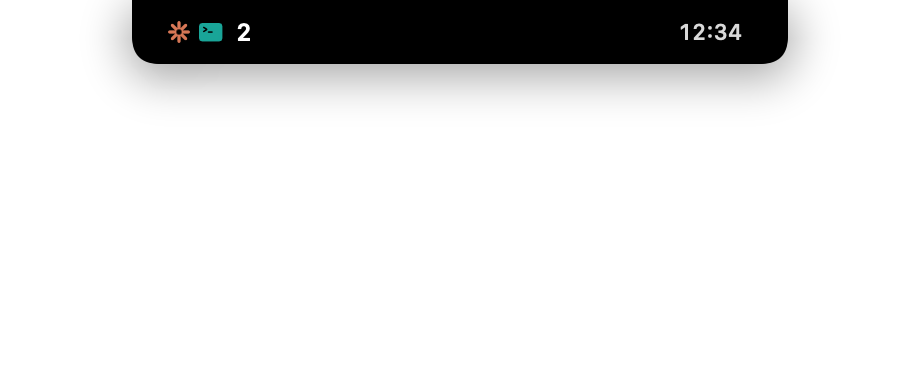
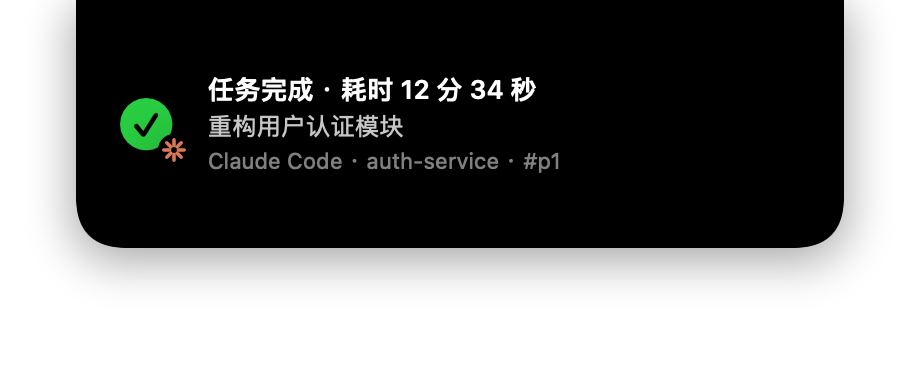
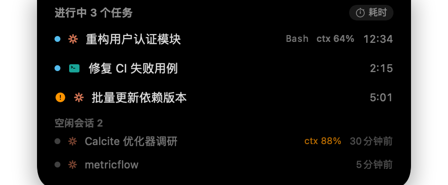

# lulu-lumei-dock ✦

**English** · [中文](README.zh-CN.md)

**A macOS menu-bar "Dynamic Island" for your local AI coding agents.**

Surfaces live task activity, a ccusage-accurate usage ledger, subscription rate‑limit
gauges, session/skill/agent/memory management, an audit trail and cloud backup — for
**Claude Code · Codex CLI · OpenCode · Grok · Antigravity · Kimi Code · Gemini CLI · Qwen Code · Hermes Agent · CodeBuddy · Qoder**, all in one overlay.

`Swift 5.10 + SwiftPM` · `Sparkle is the only third‑party dependency` · `all data stays local`
· builds with Command Line Tools (no full Xcode needed)

> **About the name** — the project (this repo) is **lulu-lumei-dock**. It is built on the internal
> **Eureka** codebase, so the Swift module names (`EurekaKit`, …), the bundle identifier
> (`com.vinlee.eureka`) and the on‑disk data directory (`~/Library/Application Support/Eureka/`) keep the
> `Eureka` name for compatibility. Renaming those would break the relay stable path and existing installs,
> so they are intentionally left as‑is.

|  |  |
|---|---|
|  |  |
| **Running** — source badge (✳ Claude / ⌨ Codex) + count + timer | **Finished** — duration / session / project / source |
|  |  |
| **Task list** — current tool / ctx% / idle sessions | **Wellness** — a gentle nudge after long vibe‑coding |

## Install

**Homebrew (recommended)**

```bash
brew tap vinlee19/tap
brew install --cask lulu-lumei-dock
```

**Manual** — download the latest `.zip` from [Releases](https://github.com/vinlee19/lulu-lumei-dock/releases), unzip `lulu-lumei-dock.app` into `/Applications`.

Starting with `v0.1.5`, installed apps can check for signed updates in **Settings → About**. `v0.1.4`
and earlier need one final manual/Homebrew upgrade before in-app updates become available.

**First launch:** the app is **ad‑hoc signed** (not Apple‑notarized), so Gatekeeper may block it. Either right‑click the app → **Open** → **Open**, or run:

```bash
xattr -dr com.apple.quarantine /Applications/lulu-lumei-dock.app
```

> The installed bundle is `lulu-lumei-dock.app` and data lives in `~/Library/Application Support/Eureka/` (the internal name stays `Eureka` for compatibility). Building from source? See [Development](#development).

## What is this?

`lulu-lumei-dock` is a native macOS menu‑bar app that watches the local logs of your AI coding
agents and turns them into a live **Dynamic Island** overlay near the notch, plus a full panel
with usage analytics, rate limits, and management for sessions, skills, agents and memory.

It works with eleven agents out of the box — **Claude Code, Codex CLI, OpenCode, Grok,
Antigravity, Kimi Code, Gemini CLI, Qwen Code, Hermes Agent, CodeBuddy, and Qoder** — and needs **no network** for its core features: everything is
derived by reading local transcript / rollout / session files. The updater checks this repository's GitHub
Releases feed by default (disable it in Settings → About); the Claude subscription rate-limit gauge is the
other network feature and remains opt-in/off by default.

It also works **without installing any hooks** — transcript/rollout watchers are the fallback, so
sessions opened before hooks were installed are still visible.

## Features

**Dynamic Island notifications**
- A compact capsule pins to the top while tasks run (fuses with the notch, or drag it anywhere and
  it snaps back to center).
- Finished / errored / interrupted cards auto‑dismiss (hover to pause); waiting‑for‑permission /
  input cards stay until you deal with them.
- Multi‑task merged counts, queued finished cards shown one by one, click the capsule to expand the
  task list (current tool, context usage `ctx%`, idle sessions).
- Toggle time display: elapsed duration ↔ the session's original start time (resolved across resume
  chains to the true creation moment).
- Unified per‑source brand marks across the whole island (Claude star, Codex pinwheel, Grok slash,
  opencode terminal, Antigravity chevrons) — one per supported agent.

**Menu bar** — e.g. `▶2 · 37%`: active task count + the max of your subscription limits (Codex 5h /
Grok weekly / Claude), colored 60% amber / 85% red, with a tooltip breakdown.

**Usage ledger** (0.00% diff vs. `ccusage`) — today / this week / this month / custom range, broken
down by source, model, project (grouped to repo root) and session; estimated cost (with separate
cache pricing); a day/hour trend chart; a weekday×hour activity heatmap; and a
**skills / plugins** tab counting `skill` / `mcp` / `agent` / `command` / `tool` invocations. Export
the last 30 days to CSV.

**Skills** — browse, create, edit, and enable/disable skills across every tool that has them.
Enable/disable is non‑destructive: the skill folder is moved to a sibling `*.eureka-disabled`
directory — except for Hermes, where the app instead edits `skills.disabled` in
`~/.hermes/config.yaml`, because moving the folder would break Hermes' bundled‑skill checksum
accounting (so no `*.eureka-disabled` directory appears for Hermes skills). Plus a
dedicated **usage‑analytics** view (list ↔ stats toggle):
- Three rankings: **recently used / most used / longest unused**, each with last‑active time and
  cumulative count.
- Every list row shows its **last‑active** time.
- A **detail page** per skill: description, a cross‑tool **configuration matrix** (which of
  Claude/Codex/Grok/Antigravity/opencode has it, and whether it is user‑authored or tool‑bundled,
  shown as brand logos), and invocation stats — **count, trigger‑time tokens, and a daily trend**.
- Note on data: per‑skill invocation data is only recoverable for **Claude** (its transcript records
  `Skill` calls with usage on the same record). Trigger‑time tokens ≈ the context size at the moment
  of invocation, not the skill's full execution cost — this is labeled in the UI.

**Memory** — browse and edit `CLAUDE.md` / `AGENTS.md` and per‑project / per‑user memory files across
tools, with in‑app markdown preview + edit (atomic save with timestamped backup).

**Agent** — manage agent / subagent definitions across tools, mirroring the skills workflow.

**Plans** — browse and manage agent plan documents.

**Limits** — subscription rate‑limit gauges:
- **Codex** and **Grok** read a local snapshot (Codex from the newest rollout's `rate_limits`; Grok
  from `~/.grok/logs/unified.jsonl` billing entries) — **zero network**, hidden when unavailable.
- **Claude** is opt‑in (off by default) and uses an unofficial endpoint; any failure hides the whole
  block. Enabling it prompts a one‑time Keychain authorization (choose "Always Allow").

**Audit** — an append‑only trail of agent tool calls (full commands / file paths, no output bodies),
with risk flagging.

**Backup** — optional cloud backup of your local data to an S3‑compatible bucket (SigV4 signed).

**Signed in-app updates** — checks once per installed-app launch by default, then lets you explicitly
approve download/install in Sparkle's standard UI. Automatic download and unattended installation stay off.

**Health & wellness** — a data‑health dashboard shows heartbeat / output / failure status of every
data source (a stalled poller turns red), plus gentle wellness cards after long continuous activity,
many concurrent sessions, or late‑night runs.

## Supported agents

| Agent | Live tasks | Usage/tokens | Rate limits | Sessions | Skills / Memory / Agents |
|---|---|---|---|---|---|
| **Claude Code** | ✅ | ✅ | ✅ (opt‑in) | ✅ | ✅ |
| **Codex CLI** | ✅ | ✅ | ✅ (local) | ✅ | ✅ |
| **opencode** | ✅ | ✅ | — | ✅ | ✅ |
| **Grok** | ✅ | activity only¹ | ✅ (local) | ✅ | ✅ |
| **Antigravity** | ✅ | activity only¹ | — | ✅ | ✅ |
| **Kimi Code** | ✅ | ✅ | — | ✅ | ✅ (skills) |
| **Gemini CLI** | ✅ | ✅ | — | ✅ | ✅ (skills/memory) |
| **Qwen Code** | ✅ | ✅ | — | ✅ | ✅ (skills/memory) |
| **Hermes Agent** | ✅² | ✅ | — | ✅ | ✅ (skills/memory/plans) |
| **CodeBuddy** | ✅ | ✅ | — | ✅ | ✅ (memory) |
| **Qoder** | ✅ | —³ | — | ✅ | ✅ (memory/plans) |

¹ Grok is subscription‑based and Antigravity stores conversations as protobuf, so neither exposes
per‑request token accounting locally — only activity (invocations / sessions) is available.
Kimi Code has no local rate‑limit snapshot and no global memory / on‑disk agent-definition
convention, so those columns are skipped for it. Gemini CLI has no local rate-limit snapshot
or agent-definition convention either; its `~/.gemini/skills` directory is shared with
Antigravity and is attributed to Gemini.

² Hermes Agent keeps sessions, messages, tokens and cost in a single SQLite database
(`~/.hermes/state.db`) rather than per-session transcript files, so it is read through a
read-only SQLite reader. Live island cards come from polling that database — its shell hooks
run synchronously on the agent's own thread and need interactive consent, so they are not
installed. One consequence: Hermes cannot report "waiting for permission". A session that was
already running when the app launches produces no card at launch, and none at all for as long as
it makes no progress; if it is genuinely still working, it surfaces on its next progress tick.
Hermes only writes `ended_at` on a clean exit, so pre-existing open rows are treated as closed at
first scan instead of being replayed as a wall of phantom cards.
Full-text search and session deletion are skipped for the same reason as opencode: every
session shares one database file. Hermes has no named subagent definitions, so the Agents page
is empty for it.

³ Qoder's CN backend reports zero token usage in its local logs, so no usage ledger is
surfaced for it — sessions, live tasks, plans and memory work normally. CodeBuddy carries
per-request tokens on its transcript `function_call` lines, which the usage scanner tails.

## Quick start

```bash
make install                 # build release + install to /Applications/lulu-lumei-dock.app
open /Applications/lulu-lumei-dock.app
```

On first launch the Settings tab opens. Go to **Settings → 集成 (Integrations)** and turn on the
integrations you want: each one names the file it will rewrite, backs it up as `*.bak.eureka.*`
first, and only ever adds or removes its own entries — hooks belonging to other tools are left
untouched. Turning a switch off uninstalls just our entries. After that, any `claude` / `codex`
task shows up on the island. Consider enabling "Launch at login".

Nothing is installed without you asking. The app also works with no integrations at all: it reads
local transcripts / rollouts / databases directly, you just get events on the next scan instead of
in real time, and terminal attribution falls back to matching running processes.

## Interaction cheatsheet

| Action | Effect |
|---|---|
| Click the capsule | Expand the running‑task list (incl. idle sessions) |
| Click a card | Advance to the next notification / dismiss |
| Hover a card | Pause auto‑dismiss |
| Drag the island | Move anywhere (incl. external displays); drop near top‑center to snap back |
| ⏱ in the task list | Toggle elapsed ↔ start time |
| Menu‑bar ✦ left‑click | Open the panel (history / sessions / usage / limits / settings …) |
| Menu‑bar ✦ right‑click | Quit |

## Configuration & data

All data lives in `~/Library/Application Support/Eureka/`:

| Path | Purpose |
|---|---|
| `eureka.sqlite` | history / usage / sessions / audit (inspect directly with `sqlite3`) |
| `events/` | event spool (hooks → relay writes here atomically, app consumes) |
| `bin/eureka-relay` | the stable path referenced by hooks/notify (re‑synced by hash on launch) |
| `pricing.json` (optional) | override the built‑in price table (USD / million tokens, prefix match) |
| `context-windows.json` (optional) | override per‑model context window size, e.g. `{"claude-opus": 1000000}` |

**Privacy:** automatic update checks contact this repository's GitHub Releases feed and can be disabled.
The opt-in "Claude subscription limits" feature sends a Keychain OAuth token to Anthropic. Core activity,
session and usage data stays local unless you explicitly configure cloud backup.

## CLI

```bash
eureka --install-claude-hooks      # install/update Claude hooks (backs up first)
eureka --uninstall-claude-hooks
eureka --install-codex-notify      # install Codex notify
eureka --uninstall-codex-notify
eureka --hooks-status              # install state for both sides
eureka --usage-snapshot            # full scan → today's usage JSON (used by the ccusage diff)
eureka --limits-snapshot [--claude]# rate-limit snapshot (Codex + Grok local; --claude also hits the unofficial API)
eureka --audit-snapshot            # dump the agent tool-call audit trail (--risk-only / --limit N)
eureka --render-previews [dir]     # offscreen-render every island state to PNG
eureka-relay inject --event stop --session demo   # inject a test event into the spool
```

## Development

```bash
make build      # debug build (Command Line Tools is enough — no full Xcode)
make test       # runs the full hand-rolled test suite (413 tests; CLT has no XCTest)
make run        # run the GUI in dev mode
make demo       # inject fake events to show every island state
make app        # release build → dist/lulu-lumei-dock.app (ad-hoc signed)
make package-release # verified ZIP + appcast containing its EdDSA signature
make install    # app + install to /Applications/lulu-lumei-dock.app
make clean      # rm -rf .build dist
Scripts/check-usage-against-ccusage.sh   # diff usage totals vs. ccusage (expect 0.00%)
```

There is no test filter — the runner (`Tests/EurekaTestsRunner/main.swift`) calls each suite
sequentially. To run a subset, comment out suite calls in `main.swift`.

## Architecture

Data flows one direction: **external agents → relay → spool → app state machine → SQLite + UI
projections.**

```
Claude Code hooks ──┐                                   ┌─ Dynamic Island NSPanel (compact/expanded)
Codex notify ───────┤→ eureka-relay → events/ spool ────│
                    │   (atomic JSON write)    ↓         ├─ NSStatusItem + NSPopover
Codex rollout tail ─┘                    SpoolConsumer   │   (history / sessions / skills / usage / limits / …)
Claude transcript watch ──────────────→ TaskStore (state machine)
usage scanners (8 in all — every agent except Antigravity) ──→ SQLite (history / usage / tool_calls / audit)
```

- **`eureka-relay`** is a tiny, fully independent binary: it always `exit 0`, keeps stdout silent,
  runs in <50ms, and writes to `tmp/` then atomically `rename`s into the spool. Hooks/notify configs
  only ever reference the stable path `~/Library/Application Support/Eureka/bin/eureka-relay`, which
  the app re‑syncs by hash on launch so upgrades never break the link.
- **Module dependency graph** (SwiftPM targets, strictly one‑directional):
  `app → {EurekaIngest, EurekaUsage, EurekaInstall, EurekaSync} → EurekaStore → EurekaKit`.
  `eureka-relay` is dependency‑free.
- **SQLite** uses the system `libsqlite3` so the DB stays `sqlite3`‑inspectable. Usage tables are
  *derived* (rebuilt from transcripts on a schema‑version bump); `task_history` / `audit_events` /
  sync tables are *facts* and are never dropped.

Full design doc: [docs/design.md](docs/design.md).

## Known limitations

- Codex's "waiting for approval" state isn't shown (rollouts don't persist approval events).
- Claude subscription limits rely on an unofficial endpoint and may break with official changes
  (it hides itself when it does).
- Per‑skill invocation data (count / tokens / trend) is **Claude‑only**: no other agent tags skill
  invocations in its logs. Hermes does keep its own `skills/.usage.json` counters, but the app does
  not read them yet, so Hermes skills show no hit count, usage bar or weekly ranking.
- `ctx%` for Claude is an estimate (window size from a per‑model table; overridable).
- Costs are local estimates against public price lists and may differ from your bill. For Hermes
  this gap is wider: its model names mostly match no price entry (tokens shown, no cost), and a name
  that happens to share a prefix with a known model is priced at that provider's public API rate
  even when Hermes routed the call through a subscription at zero marginal cost.
- Terminal attribution needs either an installed hook (exact) or a still-running agent process
  whose working directory matches the session (approximate, drawn with a dashed border). When two
  sessions of the same agent share a working directory it gives up rather than guess, so neither
  gets a terminal. Jumping only raises the terminal **application** — it cannot select the tab.
- "No completion card while you're looking at that terminal" is app-level: with several tabs open
  in one terminal, any of them being frontmost counts as "looking". Permission cards are never
  suppressed for exactly this reason.
- Installing the Claude integration adds `PreToolUse`, which runs before **every** tool call.
  Claude waits for hooks, so this adds a few milliseconds per tool call. (`PostToolUse` already
  ran once per tool call before this release, so this doubles that count rather than introducing
  it.) While "auto-update installed hooks" is on, hand-removing one of our individual hook
  events won't stick — it is treated as an out-of-date install and restored on the next launch.
  Turn the switch off in Settings → 集成, or uninstall the integration entirely.
- Skills / memory / agents / plans are scanned at launch and on demand — nothing watches the
  filesystem, so anything added outside the app appears only after you click 刷新 (each page header
  shows when it was last scanned).

## Uninstall

Use Settings → "Uninstall all" to remove hooks/notify (restoring backups), then delete
`/Applications/lulu-lumei-dock.app` and `~/Library/Application Support/Eureka/`. Nothing is left behind.

## License

[MIT](LICENSE) © 2026 vinlee19
