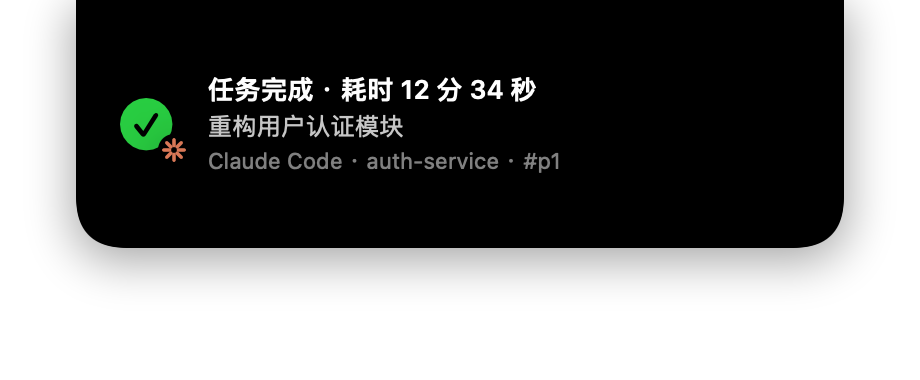
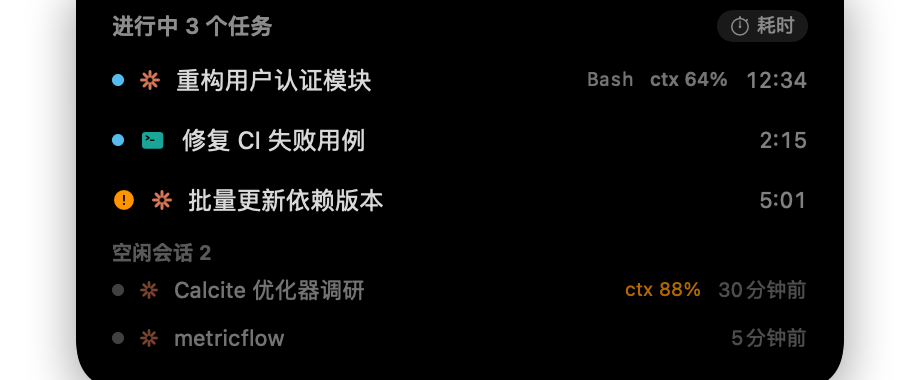

# lulu-lumei-dock ✦

[English](README.md) · **中文**

**把本地 AI 编码助手装进 macOS 菜单栏的一座「灵动岛」。**

把任务活动实时呈现,配上 ccusage 级精度的用量账本、订阅限额余量,以及会话 / 技能 / agent / 记忆管理、
操作审计与云端备份 —— 覆盖 **Claude Code · Codex CLI · opencode · Grok · Antigravity · Kimi Code**,全在一处。

`Swift 5.10 + SwiftPM` · `唯一第三方依赖为 Sparkle` · `核心数据留在本地` · 用 Command Line Tools 即可构建(无需完整 Xcode)

> **关于名字** —— 本项目(此仓库)叫 **lulu-lumei-dock**,构建于内部 **Eureka** 代码库之上,因此 Swift
> 模块名(`EurekaKit` 等)、bundle id(`com.vinlee.eureka`)与磁盘数据目录
> (`~/Library/Application Support/Eureka/`)保留 `Eureka` 名以兼容。改动这些会破坏 relay 稳定路径并让现有
> 安装 / 数据库失联,故有意保持原样。

|  |  |
|---|---|
|  |  |
| **运行中** —— 来源徽标(✳ Claude / ⌨ Codex)+ 计数 + 计时 | **完成卡** —— 耗时 / 会话 / 项目 / 来源 |
|  |  |
| **任务列表** —— 当前工具 / 上下文占用 / 空闲会话 | **健康提示** —— 熬夜编码时的温柔提醒 |

## 安装

**Homebrew(推荐)**

```bash
brew tap vinlee19/tap
brew install --cask lulu-lumei-dock
```

**手动下载** —— 从 [Releases](https://github.com/vinlee19/lulu-lumei-dock/releases) 下载最新 `.zip`,解压把 `lulu-lumei-dock.app` 拖进「应用程序」。

从 `v0.1.5` 起可在「设置 → 关于」中检查带签名的应用更新。`v0.1.4` 及更早版本需要最后一次通过
Homebrew 或 Release 手动升级，之后才具备应用内更新能力。

**首次打开:** 本应用为 **ad-hoc 签名**(未做 Apple 公证),可能被 Gatekeeper 拦截。任选其一:右键点按 App →「打开」→ 再次「打开」;或在终端执行:

```bash
xattr -dr com.apple.quarantine /Applications/lulu-lumei-dock.app
```

> 安装后的包名为 `lulu-lumei-dock.app`,数据在 `~/Library/Application Support/Eureka/`(内部名保留 `Eureka` 以兼容,见上方「关于名字」)。从源码构建见 [开发](#开发)。

## 这是什么

`lulu-lumei-dock` 是一个原生 macOS 菜单栏应用:它监视本地 AI 编码助手的日志,把任务活动实时装进刘海
旁的一座「灵动岛」,并提供一个完整面板——用量分析、订阅限额,以及会话 / 技能 / agent / 记忆的管理。

开箱支持六种助手——**Claude Code、Codex CLI、opencode、Grok、Antigravity、Kimi Code**,核心功能**零网络**:
一切都靠读取本地 transcript / rollout / session 文件推导。唯一的联网功能是 Claude 订阅限额(非官方
接口,默认关闭,可在设置里 opt‑in)。此外，更新器默认会访问本仓库的 GitHub Releases feed 检查新版，
可在「设置 → 关于」关闭。

而且**不装 hooks 也能用**——transcript/rollout 常驻监视兜底,装 hooks 之前开的老会话同样可见。

## 功能总览

**灵动岛通知**
- 任务运行中顶部常驻小胶囊(与刘海融合,也可拖到任意位置,松手自动吸附回中央)。
- 完成 / 出错 / 中断卡片自动收起(悬停暂停);等待权限 / 输入的橙卡常驻直到你处理。
- 多任务合并计数、完成卡排队逐显,点胶囊展开任务列表(当前工具、上下文占用 `ctx%`、空闲会话)。
- 时间显示可切换:已持续时长 ↔ 会话最初开始时间(跨 resume 链取真实创建时刻)。
- 全岛统一的来源徽标(Claude 八芒星 / Codex 风车 / Grok 斜杠方 / opencode 终端 / Antigravity 人字)。

**菜单栏** —— 例如 `▶2 · 37%`:活跃任务数 + 订阅限额取最大值(Codex 5h / Grok 周 / Claude),
60% 橙、85% 红,悬停看明细。

**用量账本**(与 `ccusage` 对拍偏差 0.00%)—— 今日 / 本周 / 本月 / 自定义区间,按来源、模型、项目
(归组到仓库根)、会话拆分;估算费用(缓存分价);日 / 小时趋势图;周×小时活跃热力图;以及一个
**技能 / 插件** 页,统计 `skill` / `mcp` / `agent` / `command` / `tool` 的调用次数。近 30 天可导出 CSV。

**Skills(技能)** —— 跨全部五种工具浏览、新建、编辑、启用 / 停用技能(启停非破坏:把技能目录移到同级
`*.eureka-disabled`)。并新增专用的**使用分析**视图(列表 ↔ 统计分段):
- 三档排行:**最近使用 / 最常使用 / 最久未使用**,各带最近活跃时间与累计次数。
- 每个列表行显示**最近活跃**时间。
- 每个技能的**详情页**:描述、跨工具**配置矩阵**(Claude/Codex/Grok/Antigravity/opencode 里哪些装了、
  各自是自建还是工具内置,以品牌 logo 展示)、以及调用统计——**次数、触发时 token、按天趋势**。
- 数据说明:逐技能调用数据只有 **Claude** 可得(它的 transcript 把 `Skill` 调用与用量记在同一条)。
  触发时 token ≈ 调用当轮的上下文规模,而非技能整段执行开销——UI 已明确标注。

**Memory(记忆)** —— 跨工具浏览、编辑 `CLAUDE.md` / `AGENTS.md` 与项目级 / 用户级记忆文件,应用内
markdown 预览 + 编辑(原子写入,写前留时间戳备份)。

**Agent** —— 跨工具管理 agent / 子代理定义,与技能一套工作流。

**Plans** —— 浏览与管理 agent 的计划文档。

**限额** —— 订阅额度余量:
- **Codex** 与 **Grok** 读本地快照(Codex 取最新 rollout 的 `rate_limits`;Grok 取
  `~/.grok/logs/unified.jsonl` 的账单行)——**零网络**,无数据即隐藏。
- **Claude** 为 opt‑in(默认关),走非官方接口,任何失败即整块隐藏。首次启用会弹一次钥匙串授权
  (选「始终允许」)。

**审计** —— agent 工具调用的追加式流水(完整命令 / 文件路径,不含输出正文),带风险标记。

**备份** —— 可选:把本地数据备份到 S3 兼容的云存储(SigV4 签名)。

**签名应用内更新** —— 正式安装的 App 默认每次启动检查一次；发现新版后由你确认下载 / 安装。
自动下载与无人值守安装始终关闭。

**健康关怀** —— 数据健康仪表盘展示每个数据源的心跳 / 产出 / 失败状态(轮询停摆直接红灯);外加连续
活跃过久、并发会话过多、深夜还在跑任务时的温柔提示卡。

## 支持的助手

| 助手 | 实时任务 | 用量/token | 限额 | 会话 | 技能/记忆/Agent |
|---|---|---|---|---|---|
| **Claude Code** | ✅ | ✅ | ✅(opt‑in) | ✅ | ✅ |
| **Codex CLI** | ✅ | ✅ | ✅(本地) | ✅ | ✅ |
| **opencode** | ✅ | ✅ | — | ✅ | ✅ |
| **Grok** | ✅ | 仅活动量¹ | ✅(本地) | ✅ | ✅ |
| **Antigravity** | ✅ | 仅活动量¹ | — | ✅ | ✅ |
| **Kimi Code** | ✅ | ✅ | — | ✅ | ✅(技能) |

¹ Grok 是订阅制、Antigravity 会话是 protobuf,两者本地都不暴露 per‑request token 账,只能给活动量
(调用 / 会话)。Kimi Code 无本地限额快照、无全局记忆 / 磁盘 agent 定义约定,对应列跳过。

## 快速上手

```bash
make install                 # 构建 release 并安装到 /Applications/lulu-lumei-dock.app
open /Applications/lulu-lumei-dock.app
```

首次启动自动打开设置页 → 点「**一键安装/更新**」写入 Claude hooks 与 Codex notify(写前自动备份
`*.bak.eureka.*`,可随时「全部卸载」恢复原样)。之后任何 `claude` / `codex` 任务都会出现在灵动岛上。
建议顺手打开「登录时自动启动」。

## 交互速查

| 操作 | 效果 |
|---|---|
| 点胶囊 | 展开进行中任务列表(含空闲会话) |
| 点卡片 | 切到下一条通知 / 收起 |
| 悬停卡片 | 暂停自动收起 |
| 按住岛拖动 | 移到任意位置(含外接屏),拖回顶部中央自动吸附复位 |
| 任务列表右上角 ⏱ | 切换 耗时 ↔ 开始时间 |
| 菜单栏 ✦ 左键 | 打开面板(历史 / 会话 / 用量 / 限额 / 设置 …) |
| 菜单栏 ✦ 右键 | 退出 |

## 配置与数据

所有数据都在 `~/Library/Application Support/Eureka/`:

| 路径 | 用途 |
|---|---|
| `eureka.sqlite` | 历史 / 用量 / 会话 / 审计(可直接 `sqlite3` 查询) |
| `events/` | 事件队列(hooks → relay 原子落盘,app 消费) |
| `bin/eureka-relay` | hooks/notify 引用的稳定路径(启动按 hash 自动同步) |
| `pricing.json`(可选) | 覆盖内置价格表(USD / 百万 token,前缀匹配) |
| `context-windows.json`(可选) | 按模型覆盖上下文窗口大小,如 `{"claude-opus": 1000000}` |

**隐私:** 自动更新检查会访问本仓库的 GitHub Releases feed，可在设置中关闭；「Claude 订阅限额」
这一 opt‑in 功能会携带钥匙串中的 OAuth token 访问 Anthropic。除非你主动配置云端备份，任务活动、
会话与用量数据都留在本机。

## CLI

```bash
eureka --install-claude-hooks      # 安装/更新 Claude hooks(写前备份)
eureka --uninstall-claude-hooks
eureka --install-codex-notify      # 安装 Codex notify
eureka --uninstall-codex-notify
eureka --hooks-status              # 双侧安装状态
eureka --usage-snapshot            # 全量扫描并输出今日用量 JSON(对拍脚本用)
eureka --limits-snapshot [--claude]# 限额快照(Codex + Grok 本地;--claude 同时测非官方接口)
eureka --audit-snapshot            # 输出 agent 操作审计流水(--risk-only / --limit N)
eureka --render-previews [目录]     # 离屏渲染灵动岛各形态 PNG
eureka-relay inject --event stop --session demo   # 注入测试事件
```

## 开发

```bash
make build      # 调试编译(Command Line Tools 即可,无需完整 Xcode)
make test       # 跑全部自建单测(300 个;CLT 无 XCTest)
make run        # 开发模式直跑 GUI
make demo       # 注入伪造事件,演示灵动岛全场景
make app        # 打包 dist/lulu-lumei-dock.app(ad‑hoc 签名)
make package-release # 生成已验证 ZIP + 内含 ZIP EdDSA 签名的 appcast
make install    # 打包并安装到 /Applications/lulu-lumei-dock.app
make clean      # rm -rf .build dist
Scripts/check-usage-against-ccusage.sh   # 用量与 ccusage 对拍(期望 0.00%)
```

没有测试过滤器——runner(`Tests/EurekaTestsRunner/main.swift`)顺序调用每个 suite;要只跑子集,
在 `main.swift` 里注释掉对应调用即可。

## 架构

数据单向流动:**外部助手 → relay → spool → app 状态机 → SQLite + UI 投影。**

```
Claude Code hooks ──┐                                   ┌─ 灵动岛 NSPanel(收起/展开)
Codex notify ───────┤→ eureka-relay → events/ spool ────│
                    │   (原子 JSON 写)         ↓         ├─ NSStatusItem + NSPopover
Codex rollout 监视 ─┘                    SpoolConsumer   │   (历史 / 会话 / 技能 / 用量 / 限额 / …)
Claude transcript 监视 ────────────────→ TaskStore(状态机)
用量扫描器(Claude/Codex/opencode/Grok) ────────────→ SQLite(历史 / 用量 / tool_calls / 审计)
```

- **`eureka-relay`** 是一个极小、完全独立的二进制:永远 `exit 0`、stdout 绝对静默、<50ms 完成、
  先写 `tmp/` 再原子 `rename` 进 spool。hooks/notify 配置只引用稳定路径
  `~/Library/Application Support/Eureka/bin/eureka-relay`,app 启动按 hash 重新同步,升级不断链。
- **模块依赖图**(SwiftPM target,严格单向):
  `app → {EurekaIngest, EurekaUsage, EurekaInstall, EurekaSync} → EurekaStore → EurekaKit`;
  `eureka-relay` 零依赖。
- **SQLite** 用系统 `libsqlite3`,DB 始终可 `sqlite3` 直查。用量表是*派生表*(schema 升级时从
  transcript 重建);`task_history` / `audit_events` / 备份表是*事实表*,绝不 DROP。

完整设计文档见 [docs/design.md](docs/design.md)。

## 已知边界

- Codex 的「等待审批」状态不展示(rollout 不持久化审批事件)。
- Claude 订阅限额依赖非官方接口,可能随官方变更失效(失效即隐藏)。
- 逐技能调用数据(次数 / token / 趋势)**仅 Claude**;Codex/Grok/opencode/Antigravity 的日志不标记
  技能调用。
- Claude 的 `ctx%` 为估算值(窗口大小按模型配置表,可覆盖)。
- 费用为本地按公开价目估算,与账单可能有出入。

## 卸载

设置页「全部卸载」移除 hooks/notify(自动恢复备份),然后删除 `/Applications/lulu-lumei-dock.app` 与
`~/Library/Application Support/Eureka/` 即可,不留任何残余。

## 许可证

[MIT](LICENSE) © 2026 vinlee19
